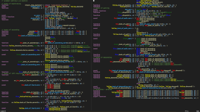

# s-machine

**A tiny grammar machine for JavaScript.**  

A hardware-linguistic object that encodes grammars as arrays of operations and runs them as a single-tape computational process.

note: color names encode semantic meaning, having them highlighted in your editor significantly improves readability.

Define grammars with opcodes `1`, `2`, `3` and get a working parser, evaluator, and AST builder — all from one tiny VM.

- ~144 lines (`s.js`)
- async-friendly
- left recursion + backtracking
- the entire machine state (including the grammar) lives on one bounded tape `new Int16Array()`

See `expr.js` for a complete, working example of the s-machine in action.

## Axiomatic Blocks

Opcode **2** (`B`) is the basic building block of the grammar.

A *B-block* is a JavaScript function — an “axiomatic block” — that performs semantics (evaluation, AST construction, I/O, etc.).

It **must** call exactly one of the machine’s two static continuations:

- **`and(o, s)`** – accept this path and continue  
- **`or(o, s)`** – reject this path and backtrack to another choice  

Every exceptional condition (like division-by-zero) must be resolved **inside** the axiomatic block by choosing either continuation.  
The programmer decides whether to:

- treat `1/0` as a value (and continue with `and`), or  
- declare the branch invalid (and call `or` to backtrack)

This keeps the machine’s control flow pure and explicit.

## How it works (short)

- Grammar rules become **opcode–argument pairs** stored on a single bounded tape.  
- The machine walks the tape, exploring alternatives using `and` / `or`.  
- Axiomatic blocks (opcode `2`) implement semantics in plain JS.  
- Everything — grammar, state, and branching choices — lives in one array.

## Status

Experimental. Small. Powerful.  
PRs with examples are welcome.

## License

(MIT)
